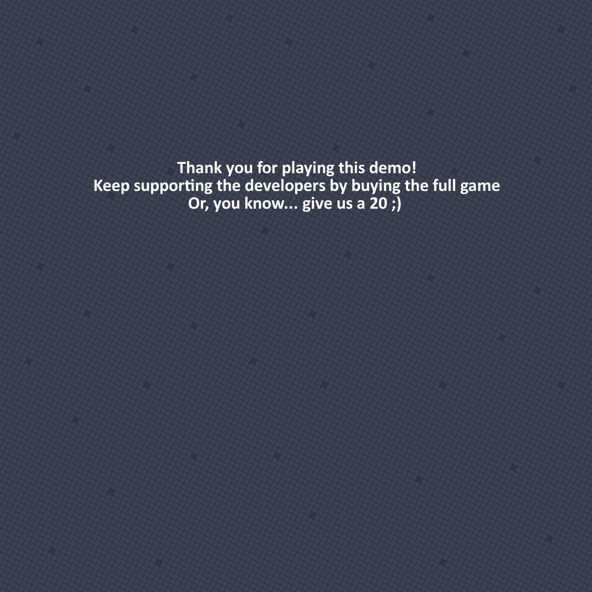

Project Checkpoint: 

UML:

	- Setup/Installation procedure
	
		- Desktop
	
		- Java
	
	
	
	
	
	
	
	- Development documentation
	
		- UML
		
		
		
		- Design Patterns Used
			
			Usámos Model/View/Controller (MVC) para a arquitetura base do nosso projeto.
	
			Usámos um Singleton nas classes GameController e GameModel visto que apenas queríamos 1 instância do jogo.
	
			Usámos um Observer para tratar colisões dos nossos Model (visto que estamos a usar o Box2d) sem que os diferentes objetos se tornassem fortemente acoplados.
	
			Usámos um Flyweigth para poupar memória, visto termos objetos que partilham os seus sprites correspondentes, apenas sofrendo modificações de direção em função da direção do Model.
	
			Usámos um Object Pool para os projéteis do Hero.
	
			Inicialmente íamos usar um State para gerir os vários estados do nosso Hero em função dos diferentes inputs, mas achámos que 1 classe por cada estado era exagero, visto apenas termos cerca de 6 estados e as suas transições eram pouco complexas, por isso decidimos usar um switch na função de move (tanto do Hero como da Slug) do estado atual, em que cada case incluiria possíveis transições para outros estados.
			
			Usámos uma Factory para (... JUAN HELP!)
		
		
		
		- Major Dificulties
		
		Tivemos múltiplas dificuldades na realização deste projeto, como seria de esperar. Uma das mais sérias foi a falta de tempo. No final deste semestre tivemos múltiplas entregas consecutivasde projetos de diferentes cadeiras, o que diminuiu bastante o tempo que pudemos dedicar a este projeto. Além disso, os exames começam dias depois da entrega, o que diminuiu ainda mais o tempo disponível. Devido a esta primeira dificuldade, rapidamente se tornou óbvio que tínhamos outro problema, fomos demasiado ambiciosos. Queríamos ter implementado mais 2 levels ao jogo, e mais 3 ou 4 enemies com AI diferentes, mas o tempo simplesmente não chegou para tudo. Conseguimos no entanto implementar funcionalidade de multijogador, algo que não estavamos à espera de conseguir realizar.
		Além disto, não fomos capazes de implementar testes unitários ao package Game.Controller devido a problemas com a biblioteca libGDX. No entanto realizamos testes na package Game.Model, com resultados (...)
		
		
		
		- Lessons Learned
		
		Aprendemos que devemos ser menos ambiciosos nestes projetos, porque o tempo nem sempre está do nosso lado e podemos acabar por prometer mais do que conseguimos cumprir.
		No entanto ambos achamos que este projeto nos ajudou bastante a compreender melhor design de jogos (e aplicações em geral), pre-planear a estrutura levou a que tivéssemos muito menos casos de "código esparguete" a tentar disfaçar erros no nosso design. A estrutura MVC provou ser bastante útil neste aspeto, sabíamos sempre onde devíamos colocar uma dada função, dependendo da sua funcionalidade.
		
		
		
		- Overall time spent developing
		
		Estimamos ter gasto cerca de 220 horas na realização deste projeto
		
		
		
		- Work distribution amongst team members
		
		Ambos os elementos trabalharam de igual forma na realização deste projeto
		
	
	
	
	- User manual
	
		O primeiro passo é iniciar o programa/aplicação (descrição de como fazer isto encontra-se na secção "Setup/Installation procedure" acima.
		
		Assumindo que a aplicação está ligada, irá ver o seguinte menu inicial:
			

		Clicando em "Singleplayer" irá iniciar o jogo em modo de jogador único. Em desktop para controlar o Hero, terá de usar as setas do teclado, e a tecla "A" para atacar (lançar bolas plasma). Em Android, terá no ecrã 4 botões como podemos ver na imagem seguinte:
		

		Os botões realizam as seguintes ações (listando da esquerda para a direita): andar para esquerda, andar para a direita, saltar e atacar.
		
		
		O objetivo do jogo é chegar ao final do nível sem morrer. O Hero morre se cair num poço ou se levar dano suficiente dos enemies.
		
		A parte inicial do nível serve para famialirizar o Hero com as mecânicas de jogo, como os controlos, a velocidade do Hero, a altura dos seus saltos, etc... Por este motivo não existem enemies nesta secção.
		Após passar esta parte do nível, começam a aparecer os enemies. A Slug tem como comportamento normal percorrer uma dada área do nível de forma cíclica. No entanto se algum Hero entrar no seu campo de visão, ela irá segui-lo indefinitamente, só voltando ao seu comportamento inicial se deixar de "ver" o Hero. Se a Slug tiver seguido o Hero para longe da sua zona de "roaming", e deixar de ver o Hero, então irá voltar a essa zona e retomar o comportamento normal.
		A Slug sofre dano quando entra em contacto com uma Plasma Ball de um Hero, e causa dano se estiver próxima o suficiente do Hero.

		No caso do Hero ganhar o jogo, o seguinte ecrã surge:
		
		
		
		E no caso de ficar sem HP ou cair num pit, o seguinte ecrã surge:
		
			

		Voltando ao menu principal, clicando em "Multiplayer" irá abrir um segundo menu que pede para especificar se o utilizador pretende dar "Host" a um jogo, ou se pretende procurar um servidor para jogar.
		
		 
				
		Se o utilizador escolher "Host", então entrará no jogo e esperará que surja um Player 2. Enquanto espera aparece uma janela que mostra o IP que o Player 2 terá de inserir para entrar no jogo, e um botão de cancelar que retorna ao menu principal caso o utilizador não queira esperar mais:
		
	

		Se o utilizador escolher "Find", então irá aparecer uma janela a pedir o IP do servidor a que se	quer conectar:
		

		
		A forma de jogador entre 1 jogador e 2 jogadores é a mesma. No entanto, o ecrã apenas é desenhado no lado do Host, o Player 2 apenas vê os botões de controlo no seu ecrã.
		
		Ecrã Player 1:			
		
		
		
		Ecrã Player 2:
		

		

